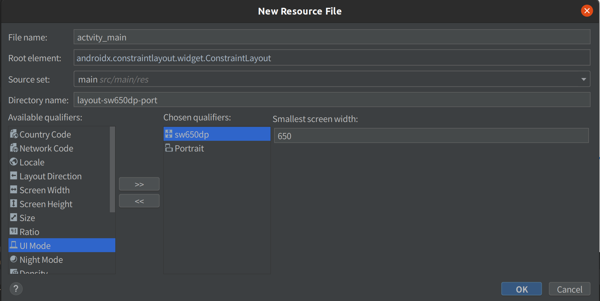
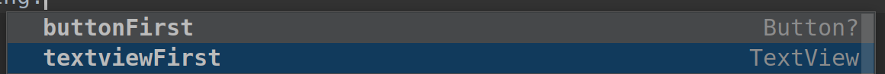

[各種の画面サイズのサポート | Android デベロッパー | Android Developers](https://developer.android.com/training/multiscreen/screensizes?hl=ja)

### レイアウトを追加

既存のレイアウト名のファイルを`layout-条件` のディレクトリに追加する



### Bindingの対応

レイアウトによっては存在しないUIへのアクセスは条件付きで行う

```kotlin
binding.buttonFirst?.setOnClickListener {
```

どちらか一方に存在しないViewはNullableになる

