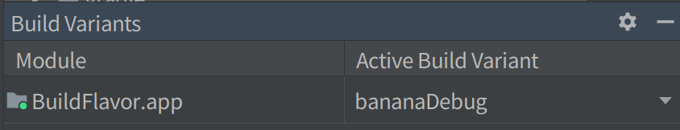
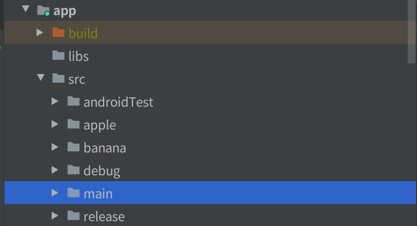
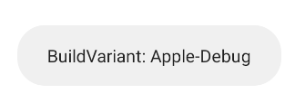
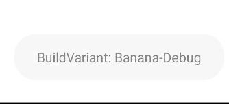

# Build Variant
### 概要
Build Variantは`Build Type`と`Build Flavor`を合わせたもので、  
これを設定するとで、アプリのデータ、設定を変えることができる

### Build Type
アプリの実行される状態を表す。  
`release`, `debug`など  
`beta`など自分で新しく作成することも可能
```groovy
buildTypes {
    release {
        // release にしたときは署名が必要になる
        minifyEnabled false
        proguardFiles getDefaultProguardFile('proguard-android-optimize.txt'), 'proguard-rules.pro'
    }

    debug {
				// デバッグのときはアプリIDの後ろに.debugを付ける
				// という変更
        applicationIdSuffix ".debug"
        debuggable true
    }
}
```

### Build Flavor
アプリのバージョンなどを表す。  
自分で新しく作成することが可能で、`demension`により何における分岐なのかを表現することができる。
```groovy
flavorDimensions "version"
productFlavors {
    apple {
        dimension "version"
        versionNameSuffix "-apple"
    }

    banana {
        dimension "version"
        versionNameSuffix "-banana"
    }
}
```

### Build Variant
**ビルドフレーバービルドタイプ**の形で表現される  

ビルドフレーバー、ビルドタイプのそれぞれでフォルダを作成することで
ビルドバライアントによってデータを変更することができる。

たとえば`bananaDebug`の場合、`banana`と`bebug`のディレクトリからデータを取得してくる。

```kotlin
val buildFlavor = getString(R.string.flavor)
val buildType = getString(R.string.type)
```  

