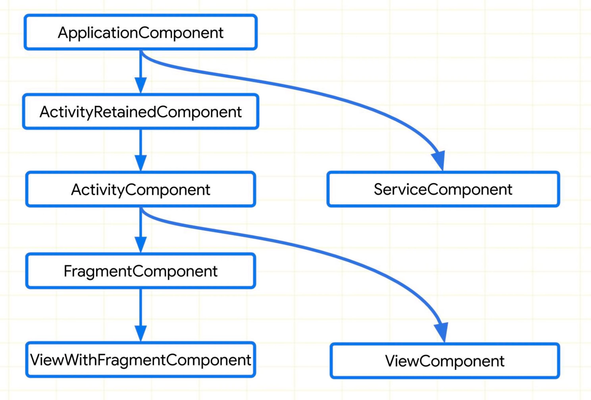
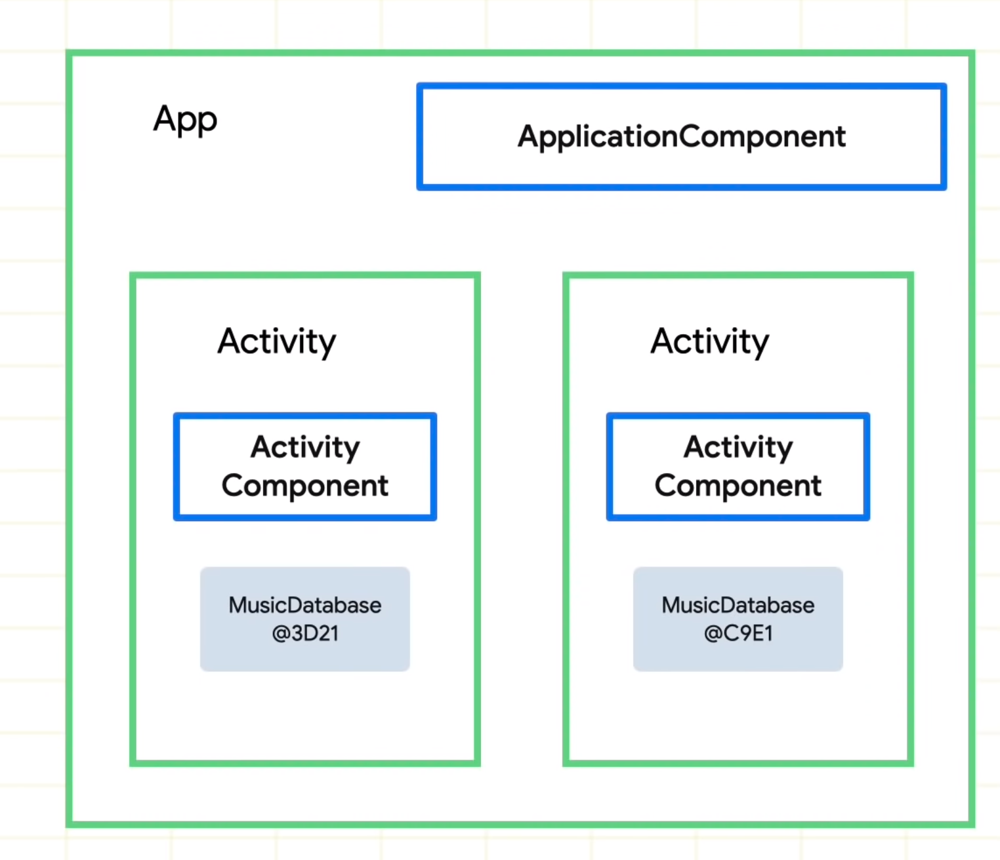

# Dagger Hilt
## Hiltを利用するための準備
### インストール
build.gradle(ルートプロジェクト)

```groovy
buildscript {
    ...
    dependencies {
        ...
        classpath 'com.google.dagger:hilt-android-gradle-plugin:2.28-alpha'
    }
}
```

build.gradle(アプリ)

```graphql
...
apply plugin: 'kotlin-kapt'
apply plugin: 'dagger.hilt.android.plugin'

android {
	  sourceCompatibility JavaVersion.VERSION_1_8
    targetCompatibility JavaVersion.VERSION_1_8
}

dependencies {
    implementation "com.google.dagger:hilt-android:2.28-alpha"
    kapt "com.google.dagger:hilt-android-compiler:2.28-alpha"
}
```
### HiltAndroidApp

`@HiltAndroidApp`アノテーションをつけた`Application`クラスを作成

→ Componentを定義する必要がなくなる

```kotlin
@HiltAndroidApp
class MyApplication: Application() {
```

```xml
<application
    android:name=".MyApplication"
		.../>
```

### AndroidEntryPoint

AndroidのクラスにHiltがDIするためには`@AndroidEntryPoint`をつけて、教える必要がある

```kotlin
@AndroidEntryPoint
class MainActivity : AppCompatActivity() {

	// HiltにDIされる
	@Inject
	lateinit var database: DatabaseInterface
```

<hr>

## 依存注入の方法
- ### コンストラクタインジェクション
  すべてのクラスにおいてコンストラクタインジェクションが可能な場合は

  モジュールを作成せずにDIが可能

  ```kotlin
  class CLASS_NAME @Inject constructor()
  ```

  ```kotlin
  class Calculator @Inject constructor(
          private val keyboard: Keyboard
  )
  ```

  ```kotlin
  class Keyboard @Inject constructor()
  ```

  ```kotlin
  @Inject
  lateinit var calculator: Calculator
  ```
- ### @Binds
    インターフェースなどのコンストラクタインジェクションができないときに利用可能

  ```kotlin
  interface DatabaseInterface
  ```

  注入されるものについてはコンストラクタインジェクションで定義されている必要がある

  ```kotlin
  class AppleDatabase @Inject constructor(): DatabaseInterface
  ```

  ### Module

  インターフェースをどの型と結びつけるかを定義するために`Module`を作成する。

  `@Binds`の場合は抽象クラスで定義する

  ```kotlin
  @Module
  @InstallIn(ActivityComponent::class)
  abstract class DatabaseModule {

      @Binds
      abstract fun bindDatabase(database: AppleDatabase): DatabaseInterface
  }
  ```

  以上の手順を踏むと、注入できるようになる

  ```kotlin
  @Inject
  lateinit var database: DatabaseInterface
  ```
- ### @Provides
    インターフェースのようにコンストラクタインジェクションができず、

  また注入されるものに関してもコンストラクタインジェクションが不可能なときにも利用可能

  **サードパーティライブラリ**のクラスを注入したいときに使える

  依存注入したいクラス

  ```kotlin
  interface Engine{
      val speed: Int
  }
  ```

  コンストラクタインジェクションが不可能なクラス

  (引数にDIできないものを持つ場合コンストラクタインジェクションが不可能になる)

  ```kotlin
  data class HondaEngine(
      override val speed: Int = 100
  ) : Engine
  ```

  ### Module

  Module内で具体的にインスタンスの生成方法を記述することでDIが可能になる

  ```kotlin
  @Module
  @InstallIn(ActivityComponent::class)
  object CarModule {
      @Provides
      fun provideEngine(): Engine {
          return HondaEngine()
      }
  }
  ```

  ### 生成時に依存するものを注入してほしいとき

  インスタンスを作成する上で、他のクラスに依存している場合がある。

  そのときは予めそのクラスの生成方法を定義しておいて、引数に指定すればそのクラスのインスタンスが自動的に渡される。

  ```kotlin
  @Provides
  fun provideCar(
          engine: Engine　// 別のところで定義したEngineを受け取っている
  ): Car{
      return HondaCar(engine)
  }
  ```
  
## 同じ型に複数のバイディングを定義
同じクラスを継承しているが、その２つを区別して注入したいときがある。

```kotlin
interface Battery
```

```kotlin
class LargeBattery : Battery
```

```kotlin
class SmallBattery : Battery
```
### 解決法: アノテーションを使って区別する

以下のようにしてアノテーションを用意しておく

```kotlin
@Qualifier
@Retention(AnnotationRetention.BINARY)
annotation class BatteryL

@Qualifier
@Retention(AnnotationRetention.BINARY)
annotation class BatteryS
```

そして`@Provide`で生成するときに、具体的に何を生成しているかをアノテーションで指定する

```kotlin
@Provides
@BatteryL
fun provideLargeBattery(): Battery {
    return LargeBattery()
}

@Provides
@BatteryS
fun provideSmallBattery(): Battery {
    return SmallBattery()
}
```

引数でアノテーションを付けて指定すれば、同じ型でも欲しい型をもらうことができる。

```kotlin
@Provides
fun providePhone(
        @BatteryL battery: Battery
): Phone {
    return Phone(battery)
}
```

<hr>

### @InstallIn


  

Moduleにおいて`@InstallIn`を指定することで、  
そのモジュールの生存期間を指定する。

```kotlin
// ApplicationComponentを指定
// -> アプリケーションが動作中、存在できる
// -> アプリケーションのどこからでもアクセスできる
@InstallIn(ApplicationComponent::class)

// FragmentComponentを指定
// -> Fragmentが生存中は利用可能
// -> Activityには依存注入できない(ActivityComponent > FragmentComponent)
@InstallIn(FragmentComponent::class)
```
<hr>


## 事前定義済みのアノテーション
`@ApplicationContext`、`@ActivityContext`は事前に定義されており

Hiltが自動的に注入してくれる。

```kotlin
class MyLogger @Inject constructor(
        @ActivityContext private val context: Context
) {
    fun log(message: String) {
        Toast.makeText(context, "MyLogger: $message", Toast.LENGTH_LONG).show()
    }
}
```

<hr>

## @EntryPoint
Androidクラスにおいては`＠AndroidEntryPoint`を指定することによりDIされる

しかし、AndroidクラスでないクラスにおいてDaggerからのDIを受けたい場合には

`@EntryPoint`というインターフェースを作成する。　　 

以下のようにアクセサメソッドを設定する

最終的にはこのエントリーポイントのアクセサメソッドから

Daggerによって注入されたインスタンスを取得できるようになる

```kotlin
@EntryPoint
@InstallIn(ApplicationComponent::class)
interface FruitsApplicationInterface{
    fun getFruits(): Fruits
}
```

DaggerでのDIの設定

```kotlin
interface Fruits
```

```kotlin
class Apple : Fruits
```

```kotlin
@Module
@InstallIn(ApplicationComponent::class)
object FruitModule {
    @Provides
    fun provideFruit(): Fruits = Apple()
}
```

### 値を取得する

DaggerからDIされたインスタンスを取得するためには`EntryPoints`によって

エントリーポイントを指定し、インスタンスを取得できる

```kotlin
val fruitsAppInterface = EntryPoints.get(context, FruitsApplicationInterface::class.java)
val fruits = fruitsAppInterface.getFruits()
```

### エントリーポイントインターフェースの定義場所

非Hiltライブラリからインスタンス化されるクラスで

Daggerから提供されるインスタンスを使用したいとき、

それを**利用するクラス内でインターフェースを定義する**ことが推奨されている。

理由として、実際にはDaggerから提供されるクラスを利用したいのではなくエントリーポイントを必要としているから。(提供されるものよりも、Daggerによって提供されるインスタンスを使えるようになることを目的としている)

**エントリーポイントインターフェースはそのクラスの`@Inject` の代わりとして使うことができる**


<hr>

## Assisted Inject
dagger Hiltの機能ではないが、ViewからViewModelに値を渡したいときなどに利用できる。
[square/AssistedInject](https://github.com/square/AssistedInject)

```kotlin
dependencies {
    // Assisted Inject
    compileOnly 'com.squareup.inject:assisted-inject-annotations-dagger2:0.6.0'
    kapt 'com.squareup.inject:assisted-inject-processor-dagger2:0.6.0'
}
```

### ViewModel

- `@AssistedInject`アノテーションのついたコンストラクタを作成
- `@Assisted`でAssistedInjectから受け取りたい引数を指定
- `@AssistedInject.Factory` で`@Assisted`に対応する引数を受け取るメソッドを作成

```kotlin
class AssistedInjectViewModel @AssistedInject constructor(
    @Assisted val userName: String,
    // 引数に＠Assistedのついていないものがないとエラーが起こる
    calculator: Calculator
) : ViewModel() {

    @AssistedInject.Factory
    interface Factory {
        fun create(userName: String): AssistedInjectViewModel
    }
}

fun AssistedInjectViewModel.Factory.create(
    userName: String
): AssistedInjectViewModel {
    return create(userName)
}
```

### Module

`@AssistedModule`アノテーションのついたモジュールを作成

```kotlin
@Module
@AssistedModule
@InstallIn(ActivityComponent::class)
object AssistedInjectModule
```

### ViewModel Factory

```kotlin
inline fun <VM: ViewModel> viewModelProviderFactoryOf(
    crossinline f: () -> VM
): ViewModelProvider.Factory = object : ViewModelProvider.Factory {
    @Suppress("UNCHECKED_CAST")
    override fun <T : ViewModel?> create(modelClass: Class<T>): T = f() as T
}
```
### View
```kotlin
@AndroidEntryPoint
class MainActivity : AppCompatActivity() {

		lateinit var factory: AssistedInjectViewModel.Factory
		
		private val assistedInjectViewModel: AssistedInjectViewModel by viewModels {
		    viewModelProviderFactoryOf { factory.create("Alice") }
		}
}
```