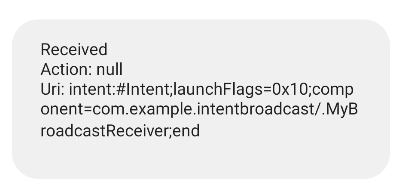

# Broadcast Reciever
- ブロードキャストされた際に受信することができる
- 何をするか(アクション)は`Intent`によって指定される
- 受信するかどうかは`Intent`の種類によって指定できる
- 他のアプリのブロードキャスト、Androidによるブロードキャストも受信できる

### ブロードキャスト

- アプリから送信される**カスタムブロードキャスト**
- Androidシステムから送信される**システムブロードキャスト**

## Broadcast Receiver

```kotlin
class MyBroadcastReceiver : BroadcastReceiver() {
    override fun onReceive(context: Context, intent: Intent) {
				val action = "Action: ${intent.action}"
        val uri = "Uri: ${intent.toUri(Intent.URI_INTENT_SCHEME)}"
        Toast.makeText(context, "Received\n$action\n$uri\n", Toast.LENGTH_LONG).show()
    }
}
```

Android Manifestに追加

```kotlin
<receiver android:name=".MyBroadcastReceiver" />
```
## 明示的なインテント

実行するレシーバーを明示的に指定する。

```kotlin
val intent = Intent(applicationContext, MyBroadcastReceiver::class.java)
sendBroadcast(intent)
```




### インテント(アクション)を指定する

- システムに用意さているインテント

    ```kotlin
    val intent = Intent(applicationContext, MyBroadcastReceiver::class.java)
    intent.action = Intent.ACTION_SEND
    // 値を渡す
    intent.putExtra("message", "Hello World")
    sendBroadcast(intent)
    ```

- カスタムインテント

    ```kotlin
    val intent = Intent(applicationContext, MyBroadcastReceiver::class.java)
    intent.action = "com.example.broadcast.INTENT_APPLE"
    sendBroadcast(intent)
    ```

```kotlin
override fun onReceive(context: Context, intent: Intent) {
		when(intent.action){
		    Intent.ACTION_SEND -> {
		        // 用意されているインテント
		        val message = intent.getStringExtra("message")
		        Toast.makeText(context, "Received: $message", Toast.LENGTH_LONG).show()
		    }
		
		    "com.example.broadcast.INTENT_APPLE" -> {
		        // 自作のインテント
		        Toast.makeText(context, "Received: APPLE!", Toast.LENGTH_LONG).show()
		    }
		
				else ->{ }
		}
}
```