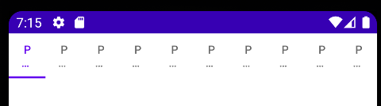
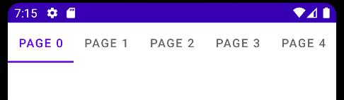

# TabLayout
## Get Started

### TabLayoutとViewPagerをレイアウトに追加

ViewPagerでページをスライドできるようにする

```xml
<com.google.android.material.tabs.TabLayout
    android:id="@+id/tab_layout"
    android:layout_width="match_parent"
    android:layout_height="wrap_content"
    app:layout_constraintTop_toTopOf="parent"
    app:tabMode="scrollable" />

<androidx.viewpager2.widget.ViewPager2
    android:id="@+id/pager"
    android:layout_width="match_parent"
    android:layout_height="0dp"
    app:layout_constraintBottom_toBottomOf="parent"
    app:layout_constraintTop_toBottomOf="@id/tab_layout" />
```

### ViewPager Adapter

```kotlin
class PageAdapter(fa: FragmentActivity): FragmentStateAdapter(fa) {
    override fun getItemCount(): Int = 10

    override fun createFragment(position: Int): Fragment {
        return PageFragment.newInstance(position)
    }
}
```

```kotlin
viewPager.adapter = PageAdapter(this)
```


### TabLayoutMediator

TabLayoutとViewPager2を結びつける

```kotlin
TabLayoutMediator(tabLayout, viewPager){ tab, position ->
    tab.text = "Page $position"
}.attach()
```

---

## スクロール



すべてのタブをページ内に収めようとする



android:tabMode="scrollable"

`android:tabMode="scrollable"`にすることでスクロール可能にする

```xml
<com.google.android.material.tabs.TabLayout

    app:tabMode="scrollable" />
```